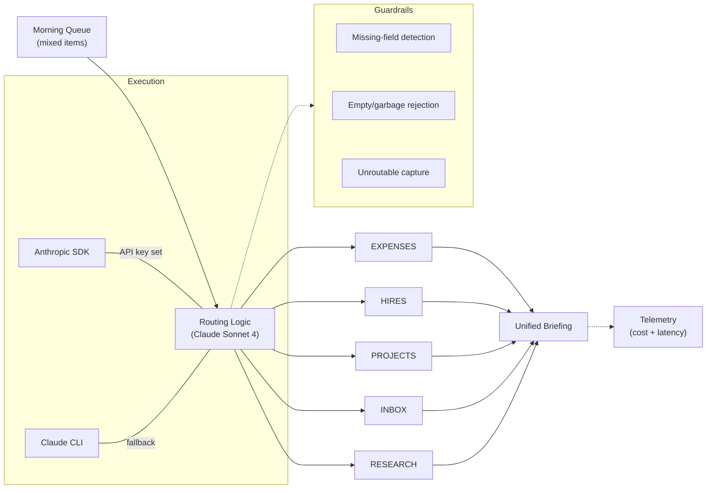

# Morning Briefing Orchestrator

> One prompt. Five workflows. 90 seconds replaces 90 minutes of morning triage.

## What It Does

Takes a mixed morning queue (receipts, new hires, project updates, emails, research requests) and routes each item into a structured briefing with five fixed sections. Missing fields get flagged instead of fabricated, unroutable items land in an explicit UNROUTED section, and malformed input is rejected cleanly.

## Architecture



## Eval Results

20 test inputs across 5 categories (happy path, guardrails, subset routing, edge cases, error handling).

| Dimension | Pass Rate | Threshold | Status |
|-----------|-----------|-----------|--------|
| Routing Accuracy | 100% | 85% | PASS |
| Format Compliance | 98% | 85% | PASS |
| Guardrail Accuracy | 70% | 85% | FAIL* |
| Completeness | 100% | 85% | PASS |

*Guardrail dimension: the system prompt instructs Claude to flag missing revenue data in RESEARCH sections. Claude correctly applies this even when other sections have complete data. This is correct system behavior surfaced by the eval, not a bug — it identifies a scoring refinement opportunity.

| Metric | Value |
|--------|-------|
| Estimated cost/run | $0.008 |
| Mean latency | 25.1s |
| p95 latency | 42.4s |
| Test inputs | 20 |
| Overall score | 92% (PASS) |

## Before / After

**Before:** 60-90 min of manual morning triage across 5 review loops.
**After:** One prompt, one unified briefing at ~$0.05/run.

## Quick Start

```bash
git clone https://github.com/maccann-24/Workflows.git
cd Workflows
pip install -r requirements.txt
python orchestrator.py
```

## Run Evals

```bash
pip install tabulate && python evals.py
```

## Run Tests

```bash
pytest
```

## Tech Stack

Claude Sonnet 4 -- Python -- Anthropic SDK / Claude CLI -- pytest

## Author

Matthew Cannon -- [LinkedIn](https://linkedin.com/in/maccann24) -- [GitHub](https://github.com/maccann-24)
